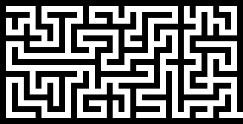

# Escape The Maze

Development of solution to codewars kata "Escape the maze".

> Given a string representation of a maze and a starting position, determine the list
> of moves required in order to escape the maze.

String representations of mazes to solve can be found in `mazes.py`.

`escape.py` loops through these mazes solving them using a Breadth-First Search
algorithm.

`viz.py` can be used to create GIFs of the escape paths. GIFs are saved to the `gifs`
directory.

### Examples

